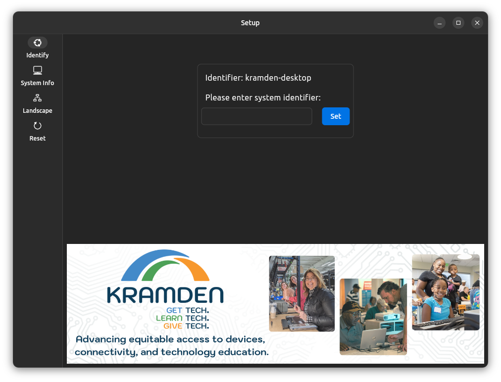
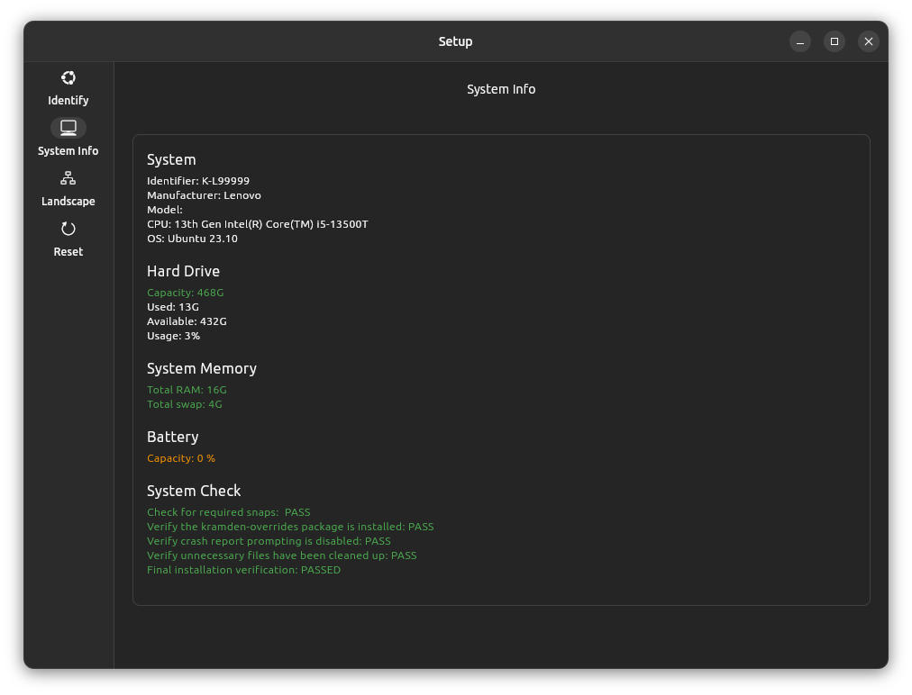
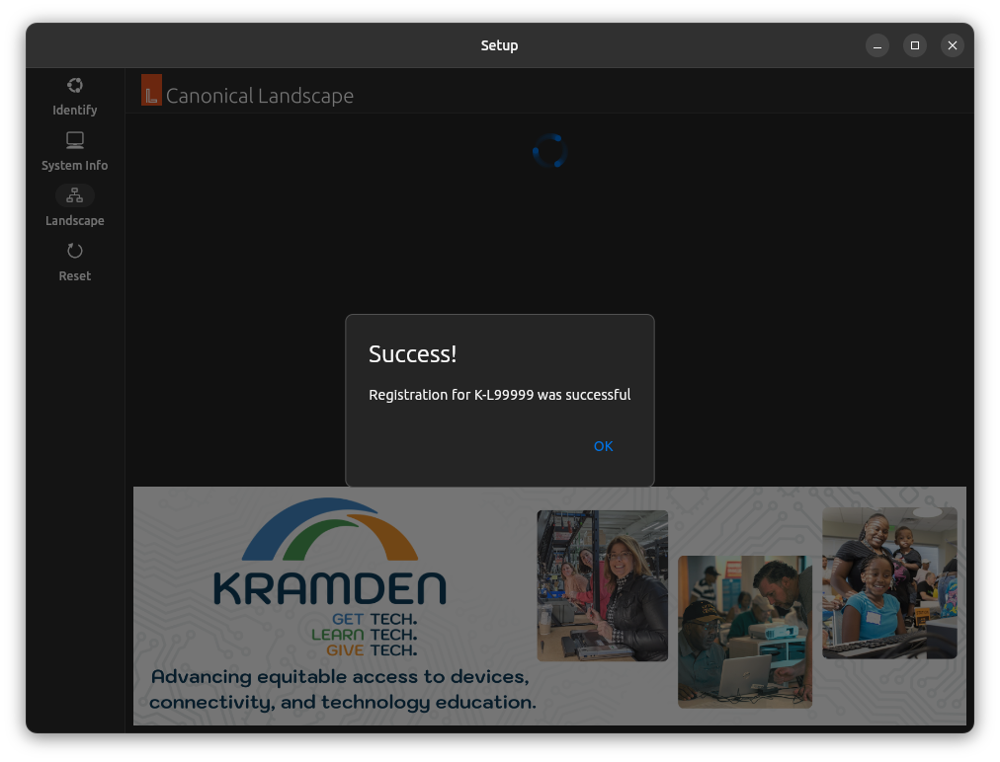
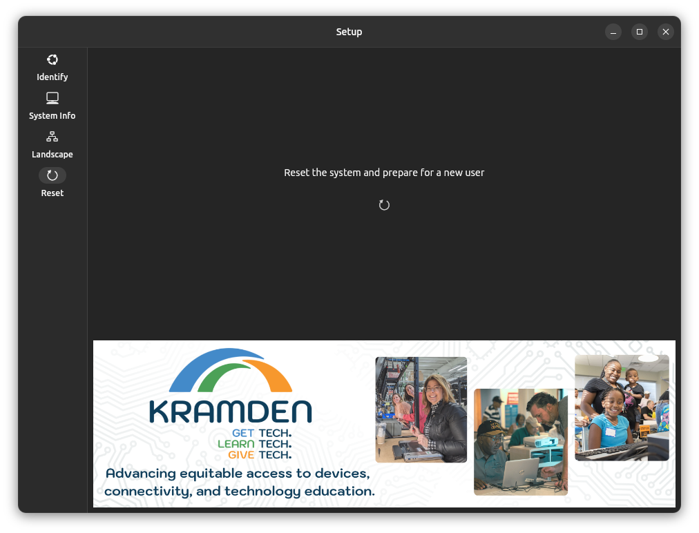

**Installation instructions, Ubuntu 23.10.1 with Kramden customizations**

Boot system to BIOS/Setup screen

Reset all BIOS defaults

Ensure UEFI boot and Secure boot **is** enabled

Insert USB stick and boot from the USB stick (*F12 at boot on Lenovo devices*)

The installation is completely automated, you don't need to do anything.  At the end of the install the system will reboot.

On the login screen, select "Owner" and enter the password "kramden" and hit enter

On first boot you will see the Kramden Setup tool

Enter the "K" number, found on the Kramden label which has been attached to the computer and click the "Set" button.

After successfully setting the "K" number, select "System Info" from the navigation bar on the left.

The System Info screen will provide information necessary to fill out the tracking sheet as well as determine if the system meets the minimum system requirements as well as show the result of the check to ensure the system was installed properly.

Pay specific attention to the "System Check" section at the bottom.  The text should be green to indicate it passed.  If the text is red, the text provided should provide a clear indication of what failed.

After filling out the tracking sheet and confirming the tests passed, select "Landscape" from the navigation bar on the left

Click the "Register" button and wait for registration to complete.

After successfully registering with landscape you can move on to system reset.  Note:  You may see a busy spinner on the landscape screen, that's fine as long you saw the "Success" dialog.

After successfully registering the system with landscape, select "Reset" from the navigation bar on the left.

Click the "Reset" in the middle of the screen, this will do a final reset, prepare the system for the new user, and power off.

**
The system is now ready to give!
**
